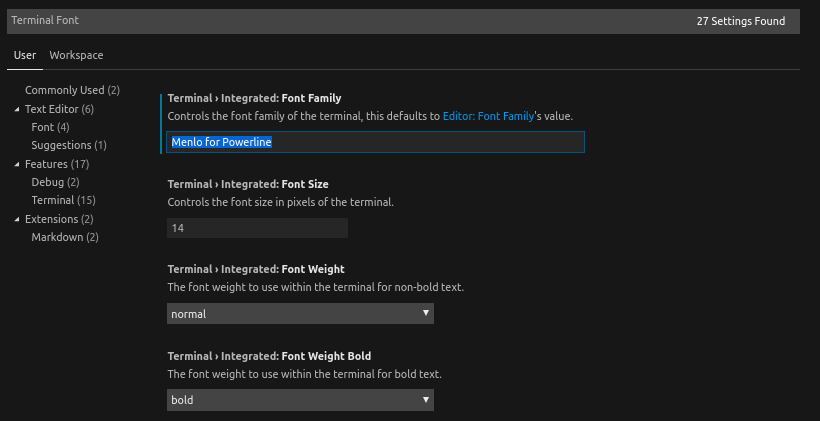

# How to setup

## Pc setup

1. From https://github.com/ohmyzsh/ohmyzsh:
   - `sh -c "$(curl -fsSL https://raw.githubusercontent.com/ohmyzsh/ohmyzsh/master/tools/install.sh)"`
2. change `ZSH_THEME="agnoster"` in ~/.zshrc
3. `sudo apt-get install fonts-powerline`

## Visual studio setup

1. `cd ~/Downloads/ && git clone https://github.com/abertsch/Menlo-for-Powerline.git`
2. `sudo mv Menlo*.ttf /usr/share/fonts`
3. Do as the image below

4. Prob restart vscode :-)
